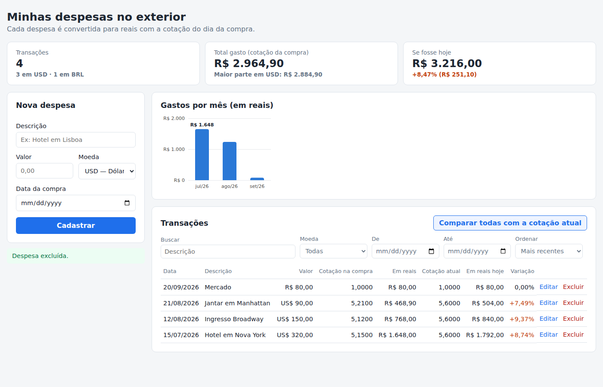

# Finanças em Moeda Estrangeira — Interface

Aplicação para registrar **despesas feitas em moeda estrangeira** (viagens, compras
internacionais, assinaturas) e ver quanto cada uma custou **em reais, pela cotação do dia
da compra**. O painel também compara com a cotação de hoje, mostrando se a mesma compra
ficaria mais cara ou mais barata agora.

Este repositório é a **Interface (módulo principal)**, feita em React. Ela conversa com:

| Repositório | Papel |
|---|---|
| **financas-frontend** (este) | Interface em React + `docker-compose.yml` que sobe tudo |
| [financas-api](https://github.com/gabrielamaiia01/financas-api) | API principal (Flask): transações, filtros, resumo |
| [financas-cambio](https://github.com/gabrielamaiia01/financas-cambio) | Módulo proxy/cache de câmbio (Flask) que consulta a AwesomeAPI |



## Funcionalidades

- **Cadastrar despesa** (`POST /transacoes`): descrição, valor, moeda e data. A API busca a
  cotação da data e devolve o valor em reais.
- **Editar despesa** (`PUT /transacoes/{id}`): se a moeda ou a data mudarem, uma nova cotação é buscada.
- **Excluir despesa** (`DELETE /transacoes/{id}`), com confirmação.
- **Listar com filtros e ordenação** (`GET /transacoes`): busca por descrição, moeda, período e
  ordenação por data, valor em reais ou descrição.
- **Painel**: totais (`GET /transacoes/resumo`), gráfico de gastos por mês com dica ao passar o mouse,
  e comparação com a cotação atual (`GET /transacoes/{id}/comparar`) com variação em %
  (laranja quando a moeda subiu, verde quando caiu).
- **Mensagens de erro claras** vindas da API (data futura, moeda inválida, serviço de câmbio fora do ar).
- Layout responsivo (funciona no celular).

## Arquitetura


1. O usuário usa a **Interface** no navegador.
2. A Interface chama a **API principal** via REST/JSON (GET, POST, PUT e DELETE).
3. Para converter valores, a API principal consulta o **módulo de câmbio** (`GET /cotacao`).
4. O módulo de câmbio procura a cotação no seu **cache SQLite**; só se não tiver, chama a
   **AwesomeAPI** e guarda o resultado.

## Como executar

### Opção 1 — Docker Compose (recomendado)

Pré-requisito: [Docker](https://docs.docker.com/get-docker/) com o Docker Compose.

```bash
git clone https://github.com/gabrielamaiia01/financas-frontend.git
cd financas-frontend
docker compose up --build
```

O Compose baixa e constrói os três componentes (inclusive a API e o módulo de câmbio, direto
dos repositórios deles no GitHub). Quando terminar:

| Serviço | Endereço |
|---|---|
| Interface | <http://localhost:8080> |
| API principal (Swagger) | <http://localhost:5000/docs> |
| Módulo de câmbio | <http://localhost:5001/cotacao?moeda=USD> |

Para parar: `docker compose down` (os dados ficam salvos em volumes; use `docker compose down -v` para apagá-los).

### Opção 2 — Só a Interface com Docker

Com a API já rodando em `http://localhost:5000`:

```bash
docker build -t financas-frontend .
docker run -p 8080:80 financas-frontend
```

Para apontar para outra API, construa com `--build-arg VITE_API_URL=http://endereco-da-api:5000`.

### Opção 3 — Ambiente de desenvolvimento

Pré-requisito: [Node.js](https://nodejs.org/) 20.19+ ou 22.12+, e a API principal rodando (veja o README do
[financas-api](https://github.com/gabrielamaiia01/financas-api)).

```bash
npm install
cp .env.example .env     # opcional: muda o endereço da API (VITE_API_URL)
npm run dev              # http://localhost:5173
```

## Testes

```bash
npm test
```

Os testes (Vitest + Testing Library) simulam a API e cobrem cadastro, edição (PUT),
exclusão (DELETE), filtros, comparação, gráfico e mensagens de erro.

## Estrutura

```
financas-frontend/
├── docker-compose.yml        # sobe Interface + API + câmbio
├── Dockerfile                # build do React + nginx
├── nginx.conf
├── docs/                     # fluxograma e captura de tela
└── src/
    ├── api.js                # chamadas à API principal (GET, POST, PUT, DELETE)
    ├── formatadores.js       # moeda, data e percentual em pt-BR
    ├── moedas.js
    ├── App.jsx               # estado da página
    ├── App.css
    ├── components/
    │   ├── Filtros.jsx
    │   ├── FormularioTransacao.jsx
    │   ├── GraficoMensal.jsx
    │   ├── Resumo.jsx
    │   └── TabelaTransacoes.jsx
    └── __tests__/App.test.jsx
```

## API externa: AwesomeAPI

As cotações vêm da [AwesomeAPI — API de Cotações](https://docs.awesomeapi.com.br/api-de-moedas),
um serviço brasileiro **público e gratuito** com cotações de mais de 150 moedas.

| Item | Informação |
|---|---|
| **Site / documentação** | <https://docs.awesomeapi.com.br/api-de-moedas> |
| **Custo** | Gratuita |
| **Licença de uso** | Não há uma licença formal (ex.: MIT) publicada. O uso é livre e gratuito, sujeito aos termos e limites informados em [awesomeapi.com.br](https://awesomeapi.com.br) e no [aviso sobre limites](https://docs.awesomeapi.com.br/aviso-sobre-limites). |
| **Cadastro** | **Não é necessário.** Sem cadastro, as respostas vêm com cache de 1 minuto no lado da AwesomeAPI, o que é suficiente para este projeto. Opcionalmente, o cadastro gratuito gera uma [API Key](https://docs.awesomeapi.com.br/instrucoes-api-key) com 100 mil requisições por mês sem cache. |
| **Quem chama a API** | Apenas o módulo [financas-cambio](https://github.com/gabrielamaiia01/financas-cambio). A Interface e a API principal nunca falam direto com ela, e o usuário nunca é redirecionado para o site externo: os dados são consumidos, tratados e exibidos dentro da aplicação. |

### Rotas utilizadas

| Rota da AwesomeAPI | Uso no projeto |
|---|---|
| `GET https://economia.awesomeapi.com.br/json/daily/{MOEDA}-BRL/{dias}?start_date=AAAAMMDD&end_date=AAAAMMDD` | Cotação **histórica** de fechamento na data da compra (ex.: `/json/daily/USD-BRL/8?start_date=20260807&end_date=20260814`). Buscamos uma janela de 7 dias para usar o último dia útil quando a compra cai em fim de semana ou feriado. |
| `GET https://economia.awesomeapi.com.br/json/last/{MOEDA}-BRL` | Cotação **atual**, usada na comparação "se fosse hoje" (ex.: `/json/last/USD-BRL`). |

Campos usados da resposta: `bid` (valor de compra da moeda em reais), `timestamp` e `create_date`.
Quando a moeda não existe, a AwesomeAPI responde `404` (`CoinNotExists`), que o módulo de câmbio
transforma em uma mensagem clara para o usuário.
